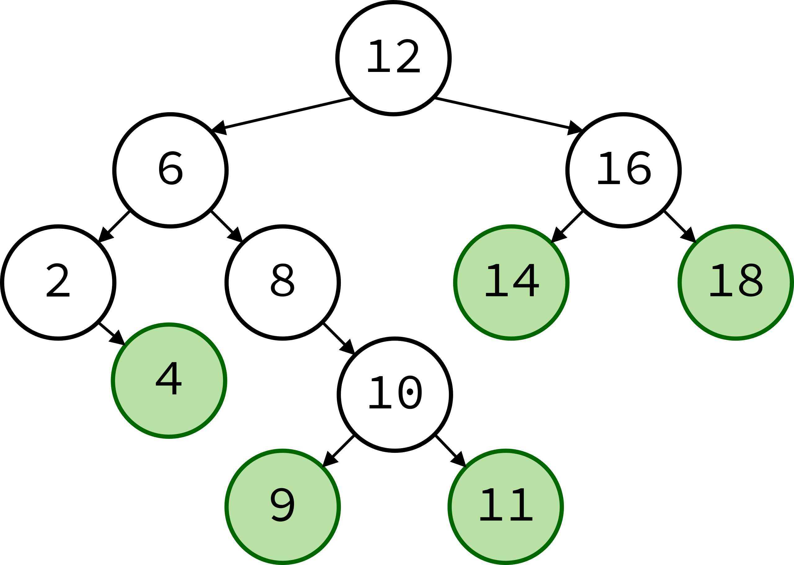
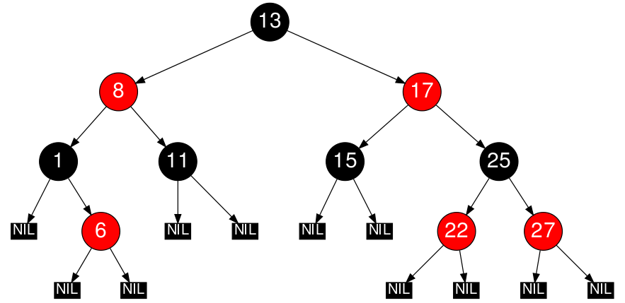
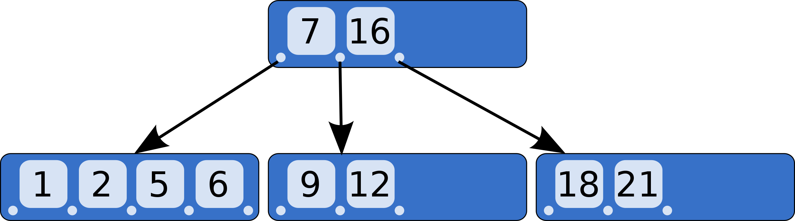
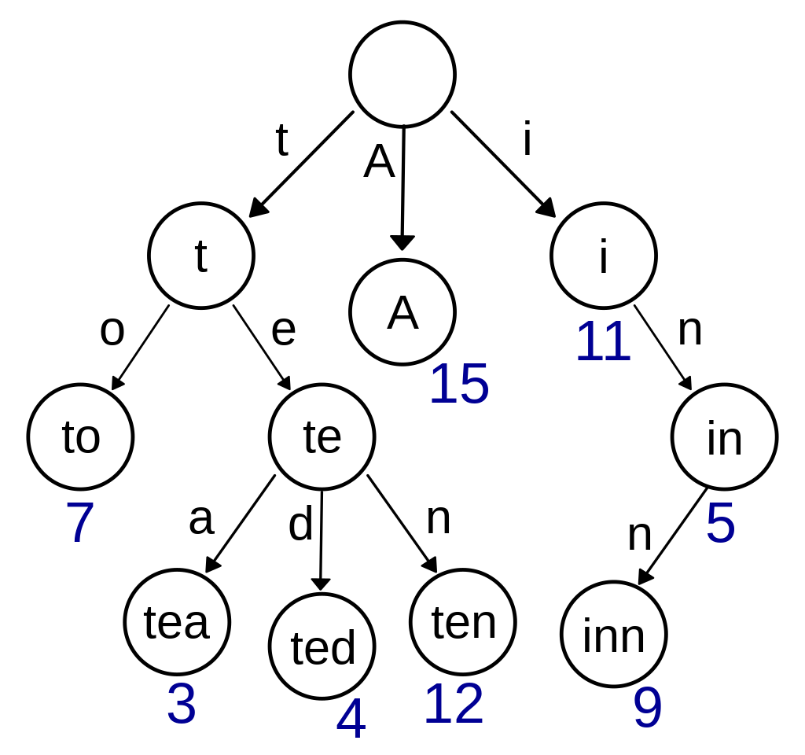

# Tree 

In Python, a tree is a data structure that allows you to store and organize data hierarchically. This means that you can have a tree with a root node, which can have child nodes, which can have their own child nodes, and so on. Each node in the tree is an object that contains data and references to its child nodes (if any).

Here is an example of how you might create a tree in Python:

```
class Tree:
    def __init__(self, value, left=None, right=None):
        self.value = value
        self.left = left
        self.right = right

root = Tree(5)
root.left = Tree(3)
root.right = Tree(7)


```
This code creates a tree with a root node that has the value 5, and two child nodes: one with the value 3, and one with the value 7. The left and right attributes of the Tree object are used to store references to the child nodes. You can add more nodes to the tree by creating additional Tree objects and attaching them to the existing nodes in the tree.

To access the data in a node, you can use the value attribute of the Tree object. For example, to print the value of the root node, you can use the following code:

```
print(root.value)  # This will print the value 5

```
To access the child nodes of a node, you can use the left and right attributes of the Tree object. For example, to print the values of the left and right child nodes of the root node, you can use the following code:

```
print(root.left.value)  # This will print the value 3
print(root.right.value) # This will print the value 7

```

Trees are a powerful data structure because they allow you to organize and store data in a way that makes it easy to search, sort, and manipulate. They are often used in algorithms and data structures that require fast searching, sorting, and other operations.

## Type of trees 

There are several types of trees that can be implemented in Python, including:

    1. Binary trees: A binary tree is a tree data structure in which each node has at most two children, which are referred to as the left child and the right child.

    2. Binary search trees: A binary search tree is a binary tree in which the value of each node is greater than or equal to the values of its left child and less than or equal to the values of its right child.

    3. Red-black trees: A red-black tree is a self-balancing binary search tree in which each node has an additional attribute, called the "color," that can be either red or black.

    4. AVL trees: An AVL tree is a self-balancing binary search tree in which the heights of the left and right subtrees of any node differ by at most one.

    5. B-trees: A B-tree is a tree data structure that is designed to store data in a large number of blocks, allowing efficient insertion, deletion, and search operations.

    6. Trie trees: A trie (also known as a prefix tree) is a tree data structure that is used to store a dynamic set of strings, where each node represents a prefix of the strings.

These are just a few examples of the types of trees that can be implemented in Python. There are many other types of trees that can be used for various purposes, depending on the needs of the application.


### Binary tree 


A binary tree is a tree data structure in which each node has at most two children, which are referred to as the left child and the right child. In Python, a binary tree can be implemented using a class with a left and right attribute that point to the left and right child nodes, respectively.


Here is an example of a simple binary tree class in Python:

```
class BinaryTree:
    def __init__(self, data):
        self.data = data
        self.left = None
        self.right = None
```

This class has a single data attribute that stores the value of the node, and left and right attributes that point to the left and right child nodes, respectively.

To create a binary tree, you can create instances of the BinaryTree class and link them together by assigning them to the left and right attributes of other tree nodes. For example:

```
root = BinaryTree(1)
root.left = BinaryTree(2)
root.right = BinaryTree(3)

```

This creates a binary tree with a root node containing the value 1, a left child node containing the value 2, and a right child node containing the value 3.

There are many different operations that can be performed on binary trees, such as traversing the tree (e.g. in-order, pre-order, or post-order), searching for a specific node, inserting new nodes, and deleting nodes.


### Binary search tree



A binary search tree (BST) is a data structure that allows efficient insertion, deletion, and search operations. It is a type of binary tree, a tree data structure in which each node has at most two children. The children are referred to as the left child and the right child.

In a binary search tree, the value of each node in the left subtree is less than the value of the root node, and the value of each node in the right subtree is greater than the value of the root node. This property allows the tree to be searched efficiently, as we can eliminate half of the tree at each step by comparing the value we are searching for with the value of the root node.

For example, to search for a particular value in a binary search tree, we start at the root node and compare the value we are searching for with the value of the root node. If the value we are searching for is less than the value of the root node, we know that the value must be in the left subtree, so we move down to the left child and repeat the process. If the value we are searching for is greater than the value of the root node, we know that the value must be in the right subtree, so we move down to the right child and repeat the process. This process continues until we find the value we are searching for, or until we reach a leaf node (a node with no children) and determine that the value is not in the tree.

Binary search trees are efficient data structures for searching and can be used in a variety of applications, such as storing and searching large datasets or implementing efficient algorithms for sorting and searching. They are also useful for implementing dictionaries and other data structures that need to support fast insertion, deletion, and search operations.

Here is an example of a simple implementation of a binary search tree in Python:

```
class Node:
    def __init__(self, value):
        self.value = value
        self.left = None
        self.right = None

class BinarySearchTree:
    def __init__(self):
        self.root = None

    def insert(self, value):
        new_node = Node(value)
        if self.root is None:
            self.root = new_node
            return
        current_node = self.root
        while True:
            if value < current_node.value:
                if current_node.left is None:
                    current_node.left = new_node
                    return
                current_node = current_node.left
            else:
                if current_node.right is None:
                    current_node.right = new_node
                    return
                current_node = current_node.right

    def search(self, value):
        if self.root is None:
            return False
        current_node = self.root
        while current_node is not None:
            if value == current_node.value:
                return True
            elif value < current_node.value:
                current_node = current_node.left
            else:
                current_node = current_node.right
        return False


```

To use this implementation, you can create a new BinarySearchTree object and call the insert method to add nodes to the tree. For example:

```
tree = BinarySearchTree()
tree.insert(10)
tree.insert(5)
tree.insert(15)
tree.insert(3)
tree.insert(7)
```

This will create a binary search tree with the following structure:

```
      10
     /  \
    5   15
   / \
  3   7
```
You can then use the search method to search for a particular value in the tree. For example:

```
tree.search(5)  # returns True
tree.search(11) # returns False

```
This implementation is a simple example and does not include methods for deleting nodes or balancing the tree to maintain good performance. There are many variations and more advanced implementations of binary search trees that address these issues.


### Red-black trees 


Red-black trees are a type of self-balancing binary search tree that are commonly used in computer science. They are called "red-black" trees because each node in the tree is either colored red or black. Red-black trees have the following properties:

    1.Every node is either red or black.
    2.The root is black.
    1.Every leaf (NULL) is black.
    1.If a node is red, then both its children are black.
    1.For each node, all simple paths from the node to descendant leaves contain the same number of black nodes.


These properties help to ensure that the tree is balanced, which means that the height of the tree is logarithmic with respect to the number of nodes in the tree. This makes operations such as search, insert, and delete faster than they would be in an unbalanced tree.

In Python, you can use the rb module from the bintrees package to work with red-black trees. Here's an example of how to create a red-black tree and insert some values into it:

```
from bintrees import rb

tree = rb.RBTree()

tree.insert(5, 'five')
tree.insert(3, 'three')
tree.insert(7, 'seven')
tree.insert(2, 'two')

print(tree.get(3))  # prints 'three'

```

You can also use the rb module to search for values in the tree, delete values from the tree, and perform other operations. For more information, you can refer to the documentation for the rb module: https://bintrees.readthedocs.io/en/latest/reference.html#module-bintrees.rb

### AVL trees

AVL trees are a type of self-balancing binary search tree that are commonly used in computer science. They are named after their inventors, G.M. Adelson-Velsky and E.M. Landis, who introduced them in their 1962 paper "An algorithm for the organization of information." AVL trees have the following properties:

    Every node has a balance factor, which is the height difference between its left and right subtrees.
    The balance factor of a node can be -1, 0, or 1.
    The height of an AVL tree is O(log n), where n is the number of nodes in the tree.

AVL trees are useful because they can be searched and modified quickly, thanks to their self-balancing nature. In Python, you can use the AVLTree class from the avltree package to work with AVL trees. Here's an example of how to create an AVL tree and insert some values into it:

```
from avltree import AVLTree

tree = AVLTree()

tree.insert(5, 'five')
tree.insert(3, 'three')
tree.insert(7, 'seven')
tree.insert(2, 'two')

print(tree.get(3))  # prints 'three'


```

You can also use the AVLTree class to search for values in the tree, delete values from the tree, and perform other operations. For more information, you can refer to the documentation for the AVLTree class: https://avltree.readthedocs.io/en/latest/api.html#avltree.AVLTree

### B-trees 



B-trees are a type of self-balancing tree data structure that are commonly used in databases and file systems. They are called "B-trees" because the data structure was first described by Bayer and McCreight in 1972. B-trees have the following properties:

    Each node in a B-tree may have a variable number of keys and children.
    The keys in a node are sorted and divided into groups, with each group having a corresponding child.
    All leaf nodes are at the same depth.
    The minimum number of keys in a node is called the minimum degree of the B-tree.

B-trees are useful because they can be searched and modified quickly, thanks to their self-balancing nature and the fact that they store multiple keys in each node. In Python, you can use the BTree class from the BTrees package to work with B-trees. Here's an example of how to create a B-tree and insert some values into it:

```
from BTrees.OOBTree import BTree

tree = BTree()

tree[5] = 'five'
tree[3] = 'three'
tree[7] = 'seven'
tree[2] = 'two'

print(tree[3])  # prints 'three'

```
You can also use the BTree class to search for values in the tree, delete values from the tree, and perform other operations. For more information, you can refer to the documentation for the BTree class: https://docs.zope.org/zodb/reference/BTrees.html#BTrees.BTree


### Trie tree 



Trie trees, also known as prefix trees, are a type of tree data structure that are commonly used for storing and searching for strings in a dictionary. Trie trees are efficient because they can search for a string in O(m) time, where m is the length of the string. They do this by storing the strings in a tree structure, with each node representing a single character in the string.

In Python, you can use the Trie class from the pytrie package to work with Trie trees. Here's an example of how to create a Trie tree and insert some strings into it:

```
from pytrie import StringTrie

tree = StringTrie()

tree["cat"] = 1
tree["car"] = 2
tree["cart"] = 3

print(tree["car"])  # prints 2

``` 
You can also use the Trie class to search for strings in the tree, delete strings from the tree, and perform other operations. For more information, you can refer to the documentation for the Trie class: https://pytrie.readthedocs.io/en/latest/api.html#trie-class


## How to Insert and Access Data From a Tree

To insert data into a tree, you need to follow the rules of the specific type of tree you are using. For example, in a binary search tree, you need to insert the data in a way that maintains the property that the left child of a node is less than the node, and the right child is greater than the node.

Here's an example of how to insert data into a binary search tree in Python:

```
class Node:
    def __init__(self, data):
        self.left = None
        self.right = None
        self.data = data

def insert(root, node):
    if root is None:
        root = node
    else:
        if root.data < node.data:
            if root.right is None:
                root.right = node
            else:
                insert(root.right, node)
        else:
            if root.left is None:
                root.left = node
            else:
                insert(root.left, node)

root = Node(5)
insert(root, Node(3))
insert(root, Node(7))
insert(root, Node(2))


```

To access data from a tree, you can use a tree traversal algorithm to visit each node in the tree and process the data stored at each node. There are several different tree traversal algorithms, including pre-order, in-order, and post-order traversal. Here's an example of how to perform an in-order traversal of a binary search tree in Python:

```
def inorder(root):
    if root:
        inorder(root.left)
        print(root.data)
        inorder(root.right)

inorder(root)  # prints 2 3 5 7


```

Keep in mind that the specific steps for inserting and accessing data from a tree will depend on the type of tree you are using and the specific requirements of your application.

## Example: List of integers

Problem: You are given a list of integers and you need to insert them into a binary search tree. You also need to implement a function that searches for a given value in the tree and returns the node containing the value, or None if the value is not present in the tree.

Solution: First, we'll define the Node class to represent a node in the tree. Each node has a left and right child and a data value. We'll also define the insert function to insert a new node into the tree. The insert function will follow the rules of a binary search tree by inserting the new node as the left child if the data value is less than the current node, or as the right child if the data value is greater than the current node.

```
class Node:
    def __init__(self, data):
        self.left = None
        self.right = None
        self.data = data

def insert(root, node):
    if root is None:
        root = node
    else:
        if root.data < node.data:
            if root.right is None:
                root.right = node
            else:
                insert(root.right, node)
        else:
            if root.left is None:
                root.left = node
            else:
                insert(root.left, node)
```

Next, we'll define the search function to search for a given value in the tree. The search function will use a recursive approach, starting at the root node and then searching the left or right subtree depending on whether the data value is less than or greater than the current node. If the value is not found, the function will return None.

```
def search(root, data):
    if root is None or root.data == data:
        return root
    if root.data < data:
        return search(root.right, data)
    else:
        return search(root.left, data)
```

Finally, we can use these functions to insert a list of integers into the tree and search for a given value:

```
# Create the root node
root = Node(5)

# Insert some values into the tree
insert(root, Node(3))
insert(root, Node(7))
insert(root, Node(2))
insert(root, Node(6))

# Search for a value in the tree
node = search(root, 6)
if node:
    print(f"Found value {node.data} in the tree")
else:
    print("Value not found in the tree")
```

This will output "Found value 6 in the tree".

## Problem to Solve

Problem: Given a tree, create a list of all leaves, including their depths and values.

Requisites:
1. A tree must be represented as a dictionary, with the root node at the top and its children as a list of dictionaries in the "children" key.
2. The function should take in the tree and return a list of tuples containing the value of the leaf and its depth (the number of edges from the root to the leaf).


Here is the solution [Solution](list_leaves.py).


Go back to the home page: [Home Page](1-welcome.md)