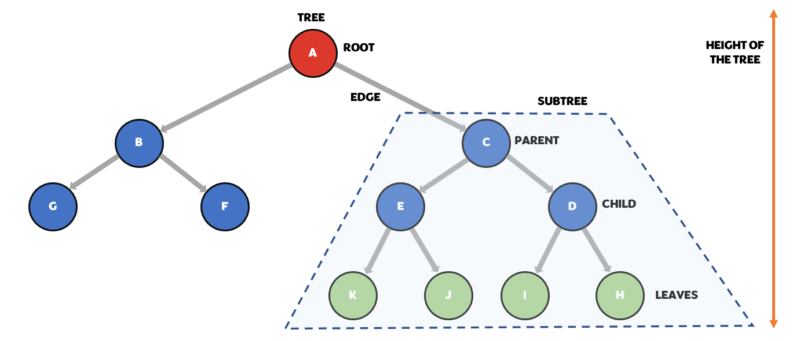

# Tree 

In Python, a tree is a data structure that allows you to store and organize data hierarchically. This means that you can have a tree with a root node, which can have child nodes, which can have their own child nodes, and so on. Each node in the tree is an object that contains data and references to its child nodes (if any).

Here is an example of how you might create a tree in Python:

```
class Tree:
    def __init__(self, value, left=None, right=None):
        self.value = value
        self.left = left
        self.right = right

root = Tree(5)
root.left = Tree(3)
root.right = Tree(7)


```
This code creates a tree with a root node that has the value 5, and two child nodes: one with the value 3, and one with the value 7. The left and right attributes of the Tree object are used to store references to the child nodes. You can add more nodes to the tree by creating additional Tree objects and attaching them to the existing nodes in the tree.

To access the data in a node, you can use the value attribute of the Tree object. For example, to print the value of the root node, you can use the following code:

```
print(root.value)  # This will print the value 5

```
To access the child nodes of a node, you can use the left and right attributes of the Tree object. For example, to print the values of the left and right child nodes of the root node, you can use the following code:

```
print(root.left.value)  # This will print the value 3
print(root.right.value) # This will print the value 7

```

Trees are a powerful data structure because they allow you to organize and store data in a way that makes it easy to search, sort, and manipulate. They are often used in algorithms and data structures that require fast searching, sorting, and other operations.

## Type of trees 

There are several types of trees that can be implemented in Python, including:

    1. Binary trees: A binary tree is a tree data structure in which each node has at most two children, which are referred to as the left child and the right child.

    2. Binary search trees: A binary search tree is a binary tree in which the value of each node is greater than or equal to the values of its left child and less than or equal to the values of its right child.

    3. Red-black trees: A red-black tree is a self-balancing binary search tree in which each node has an additional attribute, called the "color," that can be either red or black.

    4. AVL trees: An AVL tree is a self-balancing binary search tree in which the heights of the left and right subtrees of any node differ by at most one.

    5. B-trees: A B-tree is a tree data structure that is designed to store data in a large number of blocks, allowing efficient insertion, deletion, and search operations.

    6. Trie trees: A trie (also known as a prefix tree) is a tree data structure that is used to store a dynamic set of strings, where each node represents a prefix of the strings.

These are just a few examples of the types of trees that can be implemented in Python. There are many other types of trees that can be used for various purposes, depending on the needs of the application.


### Binary tree 

A binary tree is a tree data structure in which each node has at most two children, which are referred to as the left child and the right child. In Python, a binary tree can be implemented using a class with a left and right attribute that point to the left and right child nodes, respectively.


Here is an example of a simple binary tree class in Python:

```
class BinaryTree:
    def __init__(self, data):
        self.data = data
        self.left = None
        self.right = None
```

This class has a single data attribute that stores the value of the node, and left and right attributes that point to the left and right child nodes, respectively.

To create a binary tree, you can create instances of the BinaryTree class and link them together by assigning them to the left and right attributes of other tree nodes. For example:

```
root = BinaryTree(1)
root.left = BinaryTree(2)
root.right = BinaryTree(3)

```

This creates a binary tree with a root node containing the value 1, a left child node containing the value 2, and a right child node containing the value 3.

There are many different operations that can be performed on binary trees, such as traversing the tree (e.g. in-order, pre-order, or post-order), searching for a specific node, inserting new nodes, and deleting nodes.


<br>


